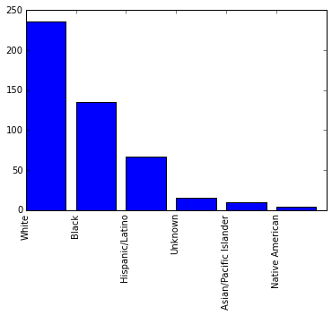
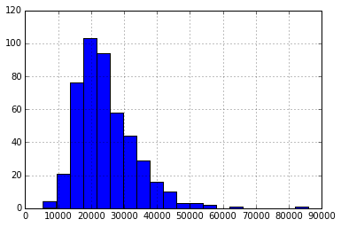

```python
import pandas as pd
police_killings = pd.read_csv("police_killings.csv", encoding="ISO-8859-1")
police_killings.head(5)
```


<div style="max-height:1000px;max-width:1500px;overflow:auto;">
<table border="1" class="dataframe">
  <thead>
    <tr style="text-align: right;">
      <th></th>
      <th>name</th>
      <th>age</th>
      <th>gender</th>
      <th>raceethnicity</th>
      <th>month</th>
      <th>day</th>
      <th>year</th>
      <th>streetaddress</th>
      <th>city</th>
      <th>state</th>
      <th>...</th>
      <th>share_hispanic</th>
      <th>p_income</th>
      <th>h_income</th>
      <th>county_income</th>
      <th>comp_income</th>
      <th>county_bucket</th>
      <th>nat_bucket</th>
      <th>pov</th>
      <th>urate</th>
      <th>college</th>
    </tr>
  </thead>
  <tbody>
    <tr>
      <th>0</th>
      <td>A'donte Washington</td>
      <td>16</td>
      <td>Male</td>
      <td>Black</td>
      <td>February</td>
      <td>23</td>
      <td>2015</td>
      <td>Clearview Ln</td>
      <td>Millbrook</td>
      <td>AL</td>
      <td>...</td>
      <td>5.6</td>
      <td>28375</td>
      <td>51367</td>
      <td>54766</td>
      <td>0.937936</td>
      <td>3</td>
      <td>3</td>
      <td>14.1</td>
      <td>0.097686</td>
      <td>0.168510</td>
    </tr>
    <tr>
      <th>1</th>
      <td>Aaron Rutledge</td>
      <td>27</td>
      <td>Male</td>
      <td>White</td>
      <td>April</td>
      <td>2</td>
      <td>2015</td>
      <td>300 block Iris Park Dr</td>
      <td>Pineville</td>
      <td>LA</td>
      <td>...</td>
      <td>0.5</td>
      <td>14678</td>
      <td>27972</td>
      <td>40930</td>
      <td>0.683411</td>
      <td>2</td>
      <td>1</td>
      <td>28.8</td>
      <td>0.065724</td>
      <td>0.111402</td>
    </tr>
    <tr>
      <th>2</th>
      <td>Aaron Siler</td>
      <td>26</td>
      <td>Male</td>
      <td>White</td>
      <td>March</td>
      <td>14</td>
      <td>2015</td>
      <td>22nd Ave and 56th St</td>
      <td>Kenosha</td>
      <td>WI</td>
      <td>...</td>
      <td>16.8</td>
      <td>25286</td>
      <td>45365</td>
      <td>54930</td>
      <td>0.825869</td>
      <td>2</td>
      <td>3</td>
      <td>14.6</td>
      <td>0.166293</td>
      <td>0.147312</td>
    </tr>
    <tr>
      <th>3</th>
      <td>Aaron Valdez</td>
      <td>25</td>
      <td>Male</td>
      <td>Hispanic/Latino</td>
      <td>March</td>
      <td>11</td>
      <td>2015</td>
      <td>3000 Seminole Ave</td>
      <td>South Gate</td>
      <td>CA</td>
      <td>...</td>
      <td>98.8</td>
      <td>17194</td>
      <td>48295</td>
      <td>55909</td>
      <td>0.863814</td>
      <td>3</td>
      <td>3</td>
      <td>11.7</td>
      <td>0.124827</td>
      <td>0.050133</td>
    </tr>
    <tr>
      <th>4</th>
      <td>Adam Jovicic</td>
      <td>29</td>
      <td>Male</td>
      <td>White</td>
      <td>March</td>
      <td>19</td>
      <td>2015</td>
      <td>364 Hiwood Ave</td>
      <td>Munroe Falls</td>
      <td>OH</td>
      <td>...</td>
      <td>1.7</td>
      <td>33954</td>
      <td>68785</td>
      <td>49669</td>
      <td>1.384868</td>
      <td>5</td>
      <td>4</td>
      <td>1.9</td>
      <td>0.063550</td>
      <td>0.403954</td>
    </tr>
  </tbody>
</table>
<p>5 rows × 34 columns</p>
</div>


```python
police_killings.columns
```


    Index(['name', 'age', 'gender', 'raceethnicity', 'month', 'day', 'year',
           'streetaddress', 'city', 'state', 'latitude', 'longitude', 'state_fp',
           'county_fp', 'tract_ce', 'geo_id', 'county_id', 'namelsad',
           'lawenforcementagency', 'cause', 'armed', 'pop', 'share_white',
           'share_black', 'share_hispanic', 'p_income', 'h_income',
           'county_income', 'comp_income', 'county_bucket', 'nat_bucket', 'pov',
           'urate', 'college'],
          dtype='object')


```python
counts = police_killings["raceethnicity"].value_counts()
```


    ['White',
     'Black',
     'Hispanic/Latino',
     'Unknown',
     'Asian/Pacific Islander',
     'Native American']


```python
%matplotlib inline
import matplotlib.pyplot as plt

plt.bar(range(6), counts)
plt.xticks(range(6), counts.index, rotation="vertical")
```


    ([<matplotlib.axis.XTick at 0x10800db70>,
      <matplotlib.axis.XTick at 0x10809f4e0>,
      <matplotlib.axis.XTick at 0x106a85748>,
      <matplotlib.axis.XTick at 0x106b67128>,
      <matplotlib.axis.XTick at 0x106b67b38>,
      <matplotlib.axis.XTick at 0x106b6a588>],
     <a list of 6 Text xticklabel objects>)





```python
counts / sum(counts)
```


    White                     0.505353
    Black                     0.289079
    Hispanic/Latino           0.143469
    Unknown                   0.032120
    Asian/Pacific Islander    0.021413
    Native American           0.008565
    dtype: float64


## Racial breakdown


```python
police_killings["p_income"][police_killings["p_income"] != "-"].astype(float).hist(bins=20)
```


    <matplotlib.axes._subplots.AxesSubplot at 0x107f797f0>





```python
police_killings["p_income"][police_killings["p_income"] != "-"].astype(float).median()
```


    22348.0


# Income breakdown


```python
state_pop = pd.read_csv("state_population.csv")
```


```python
counts = police_killings["state_fp"].value_counts()

states = pd.DataFrame({"STATE": counts.index, "shootings": counts})
```


```python
states = states.merge(state_pop, on="STATE")
```


```python
states["pop_millions"] = states["POPESTIMATE2015"] / 1000000
states["rate"] = states["shootings"] / states["pop_millions"]

states.sort("rate")
```


<div style="max-height:1000px;max-width:1500px;overflow:auto;">
<table border="1" class="dataframe">
  <thead>
    <tr style="text-align: right;">
      <th></th>
      <th>STATE</th>
      <th>shootings</th>
      <th>SUMLEV</th>
      <th>REGION</th>
      <th>DIVISION</th>
      <th>NAME</th>
      <th>POPESTIMATE2015</th>
      <th>POPEST18PLUS2015</th>
      <th>PCNT_POPEST18PLUS</th>
      <th>rate</th>
      <th>pop_millions</th>
    </tr>
  </thead>
  <tbody>
    <tr>
      <th>43</th>
      <td>9</td>
      <td>1</td>
      <td>40</td>
      <td>1</td>
      <td>1</td>
      <td>Connecticut</td>
      <td>3590886</td>
      <td>2826827</td>
      <td>78.7</td>
      <td>0.278483</td>
      <td>3.590886</td>
    </tr>
    <tr>
      <th>22</th>
      <td>42</td>
      <td>7</td>
      <td>40</td>
      <td>1</td>
      <td>2</td>
      <td>Pennsylvania</td>
      <td>12802503</td>
      <td>10112229</td>
      <td>79.0</td>
      <td>0.546768</td>
      <td>12.802503</td>
    </tr>
    <tr>
      <th>38</th>
      <td>19</td>
      <td>2</td>
      <td>40</td>
      <td>2</td>
      <td>4</td>
      <td>Iowa</td>
      <td>3123899</td>
      <td>2395103</td>
      <td>76.7</td>
      <td>0.640226</td>
      <td>3.123899</td>
    </tr>
    <tr>
      <th>6</th>
      <td>36</td>
      <td>13</td>
      <td>40</td>
      <td>1</td>
      <td>2</td>
      <td>New York</td>
      <td>19795791</td>
      <td>15584974</td>
      <td>78.7</td>
      <td>0.656705</td>
      <td>19.795791</td>
    </tr>
    <tr>
      <th>29</th>
      <td>25</td>
      <td>5</td>
      <td>40</td>
      <td>1</td>
      <td>1</td>
      <td>Massachusetts</td>
      <td>6794422</td>
      <td>5407335</td>
      <td>79.6</td>
      <td>0.735898</td>
      <td>6.794422</td>
    </tr>
    <tr>
      <th>42</th>
      <td>33</td>
      <td>1</td>
      <td>40</td>
      <td>1</td>
      <td>1</td>
      <td>New Hampshire</td>
      <td>1330608</td>
      <td>1066610</td>
      <td>80.2</td>
      <td>0.751536</td>
      <td>1.330608</td>
    </tr>
    <tr>
      <th>45</th>
      <td>23</td>
      <td>1</td>
      <td>40</td>
      <td>1</td>
      <td>1</td>
      <td>Maine</td>
      <td>1329328</td>
      <td>1072948</td>
      <td>80.7</td>
      <td>0.752260</td>
      <td>1.329328</td>
    </tr>
    <tr>
      <th>11</th>
      <td>17</td>
      <td>11</td>
      <td>40</td>
      <td>2</td>
      <td>3</td>
      <td>Illinois</td>
      <td>12859995</td>
      <td>9901322</td>
      <td>77.0</td>
      <td>0.855366</td>
      <td>12.859995</td>
    </tr>
    <tr>
      <th>12</th>
      <td>39</td>
      <td>10</td>
      <td>40</td>
      <td>2</td>
      <td>3</td>
      <td>Ohio</td>
      <td>11613423</td>
      <td>8984946</td>
      <td>77.4</td>
      <td>0.861073</td>
      <td>11.613423</td>
    </tr>
    <tr>
      <th>31</th>
      <td>55</td>
      <td>5</td>
      <td>40</td>
      <td>2</td>
      <td>3</td>
      <td>Wisconsin</td>
      <td>5771337</td>
      <td>4476711</td>
      <td>77.6</td>
      <td>0.866350</td>
      <td>5.771337</td>
    </tr>
    <tr>
      <th>16</th>
      <td>26</td>
      <td>9</td>
      <td>40</td>
      <td>2</td>
      <td>3</td>
      <td>Michigan</td>
      <td>9922576</td>
      <td>7715272</td>
      <td>77.8</td>
      <td>0.907023</td>
      <td>9.922576</td>
    </tr>
    <tr>
      <th>28</th>
      <td>47</td>
      <td>6</td>
      <td>40</td>
      <td>3</td>
      <td>6</td>
      <td>Tennessee</td>
      <td>6600299</td>
      <td>5102688</td>
      <td>77.3</td>
      <td>0.909050</td>
      <td>6.600299</td>
    </tr>
    <tr>
      <th>15</th>
      <td>37</td>
      <td>10</td>
      <td>40</td>
      <td>3</td>
      <td>5</td>
      <td>North Carolina</td>
      <td>10042802</td>
      <td>7752234</td>
      <td>77.2</td>
      <td>0.995738</td>
      <td>10.042802</td>
    </tr>
    <tr>
      <th>36</th>
      <td>32</td>
      <td>3</td>
      <td>40</td>
      <td>4</td>
      <td>8</td>
      <td>Nevada</td>
      <td>2890845</td>
      <td>2221681</td>
      <td>76.9</td>
      <td>1.037759</td>
      <td>2.890845</td>
    </tr>
    <tr>
      <th>18</th>
      <td>51</td>
      <td>9</td>
      <td>40</td>
      <td>3</td>
      <td>5</td>
      <td>Virginia</td>
      <td>8382993</td>
      <td>6512571</td>
      <td>77.7</td>
      <td>1.073602</td>
      <td>8.382993</td>
    </tr>
    <tr>
      <th>40</th>
      <td>54</td>
      <td>2</td>
      <td>40</td>
      <td>3</td>
      <td>5</td>
      <td>West Virginia</td>
      <td>1844128</td>
      <td>1464532</td>
      <td>79.4</td>
      <td>1.084523</td>
      <td>1.844128</td>
    </tr>
    <tr>
      <th>25</th>
      <td>27</td>
      <td>6</td>
      <td>40</td>
      <td>2</td>
      <td>4</td>
      <td>Minnesota</td>
      <td>5489594</td>
      <td>4205207</td>
      <td>76.6</td>
      <td>1.092977</td>
      <td>5.489594</td>
    </tr>
    <tr>
      <th>20</th>
      <td>18</td>
      <td>8</td>
      <td>40</td>
      <td>2</td>
      <td>3</td>
      <td>Indiana</td>
      <td>6619680</td>
      <td>5040224</td>
      <td>76.1</td>
      <td>1.208518</td>
      <td>6.619680</td>
    </tr>
    <tr>
      <th>8</th>
      <td>34</td>
      <td>11</td>
      <td>40</td>
      <td>1</td>
      <td>2</td>
      <td>New Jersey</td>
      <td>8958013</td>
      <td>6959192</td>
      <td>77.7</td>
      <td>1.227951</td>
      <td>8.958013</td>
    </tr>
    <tr>
      <th>35</th>
      <td>5</td>
      <td>4</td>
      <td>40</td>
      <td>3</td>
      <td>7</td>
      <td>Arkansas</td>
      <td>2978204</td>
      <td>2272904</td>
      <td>76.3</td>
      <td>1.343091</td>
      <td>2.978204</td>
    </tr>
    <tr>
      <th>2</th>
      <td>12</td>
      <td>29</td>
      <td>40</td>
      <td>3</td>
      <td>5</td>
      <td>Florida</td>
      <td>20271272</td>
      <td>16166143</td>
      <td>79.7</td>
      <td>1.430596</td>
      <td>20.271272</td>
    </tr>
    <tr>
      <th>44</th>
      <td>11</td>
      <td>1</td>
      <td>40</td>
      <td>3</td>
      <td>5</td>
      <td>District of Columbia</td>
      <td>672228</td>
      <td>554121</td>
      <td>82.4</td>
      <td>1.487591</td>
      <td>0.672228</td>
    </tr>
    <tr>
      <th>9</th>
      <td>53</td>
      <td>11</td>
      <td>40</td>
      <td>4</td>
      <td>9</td>
      <td>Washington</td>
      <td>7170351</td>
      <td>5558509</td>
      <td>77.5</td>
      <td>1.534095</td>
      <td>7.170351</td>
    </tr>
    <tr>
      <th>5</th>
      <td>13</td>
      <td>16</td>
      <td>40</td>
      <td>3</td>
      <td>5</td>
      <td>Georgia</td>
      <td>10214860</td>
      <td>7710688</td>
      <td>75.5</td>
      <td>1.566346</td>
      <td>10.214860</td>
    </tr>
    <tr>
      <th>23</th>
      <td>21</td>
      <td>7</td>
      <td>40</td>
      <td>3</td>
      <td>6</td>
      <td>Kentucky</td>
      <td>4425092</td>
      <td>3413425</td>
      <td>77.1</td>
      <td>1.581888</td>
      <td>4.425092</td>
    </tr>
    <tr>
      <th>13</th>
      <td>29</td>
      <td>10</td>
      <td>40</td>
      <td>2</td>
      <td>4</td>
      <td>Missouri</td>
      <td>6083672</td>
      <td>4692196</td>
      <td>77.1</td>
      <td>1.643744</td>
      <td>6.083672</td>
    </tr>
    <tr>
      <th>21</th>
      <td>1</td>
      <td>8</td>
      <td>40</td>
      <td>3</td>
      <td>6</td>
      <td>Alabama</td>
      <td>4858979</td>
      <td>3755483</td>
      <td>77.3</td>
      <td>1.646436</td>
      <td>4.858979</td>
    </tr>
    <tr>
      <th>14</th>
      <td>24</td>
      <td>10</td>
      <td>40</td>
      <td>3</td>
      <td>5</td>
      <td>Maryland</td>
      <td>6006401</td>
      <td>4658175</td>
      <td>77.6</td>
      <td>1.664891</td>
      <td>6.006401</td>
    </tr>
    <tr>
      <th>30</th>
      <td>49</td>
      <td>5</td>
      <td>40</td>
      <td>4</td>
      <td>8</td>
      <td>Utah</td>
      <td>2995919</td>
      <td>2083423</td>
      <td>69.5</td>
      <td>1.668937</td>
      <td>2.995919</td>
    </tr>
    <tr>
      <th>46</th>
      <td>56</td>
      <td>1</td>
      <td>40</td>
      <td>4</td>
      <td>8</td>
      <td>Wyoming</td>
      <td>586107</td>
      <td>447212</td>
      <td>76.3</td>
      <td>1.706173</td>
      <td>0.586107</td>
    </tr>
    <tr>
      <th>1</th>
      <td>48</td>
      <td>47</td>
      <td>40</td>
      <td>3</td>
      <td>7</td>
      <td>Texas</td>
      <td>27469114</td>
      <td>20257343</td>
      <td>73.7</td>
      <td>1.711013</td>
      <td>27.469114</td>
    </tr>
    <tr>
      <th>17</th>
      <td>45</td>
      <td>9</td>
      <td>40</td>
      <td>3</td>
      <td>5</td>
      <td>South Carolina</td>
      <td>4896146</td>
      <td>3804558</td>
      <td>77.7</td>
      <td>1.838180</td>
      <td>4.896146</td>
    </tr>
    <tr>
      <th>0</th>
      <td>6</td>
      <td>74</td>
      <td>40</td>
      <td>4</td>
      <td>9</td>
      <td>California</td>
      <td>39144818</td>
      <td>30023902</td>
      <td>76.7</td>
      <td>1.890416</td>
      <td>39.144818</td>
    </tr>
    <tr>
      <th>37</th>
      <td>30</td>
      <td>2</td>
      <td>40</td>
      <td>4</td>
      <td>8</td>
      <td>Montana</td>
      <td>1032949</td>
      <td>806529</td>
      <td>78.1</td>
      <td>1.936204</td>
      <td>1.032949</td>
    </tr>
    <tr>
      <th>19</th>
      <td>41</td>
      <td>8</td>
      <td>40</td>
      <td>4</td>
      <td>9</td>
      <td>Oregon</td>
      <td>4028977</td>
      <td>3166121</td>
      <td>78.6</td>
      <td>1.985616</td>
      <td>4.028977</td>
    </tr>
    <tr>
      <th>26</th>
      <td>28</td>
      <td>6</td>
      <td>40</td>
      <td>3</td>
      <td>6</td>
      <td>Mississippi</td>
      <td>2992333</td>
      <td>2265485</td>
      <td>75.7</td>
      <td>2.005124</td>
      <td>2.992333</td>
    </tr>
    <tr>
      <th>24</th>
      <td>20</td>
      <td>6</td>
      <td>40</td>
      <td>2</td>
      <td>4</td>
      <td>Kansas</td>
      <td>2911641</td>
      <td>2192084</td>
      <td>75.3</td>
      <td>2.060694</td>
      <td>2.911641</td>
    </tr>
    <tr>
      <th>41</th>
      <td>10</td>
      <td>2</td>
      <td>40</td>
      <td>3</td>
      <td>5</td>
      <td>Delaware</td>
      <td>945934</td>
      <td>741548</td>
      <td>78.4</td>
      <td>2.114312</td>
      <td>0.945934</td>
    </tr>
    <tr>
      <th>7</th>
      <td>8</td>
      <td>12</td>
      <td>40</td>
      <td>4</td>
      <td>8</td>
      <td>Colorado</td>
      <td>5456574</td>
      <td>4199509</td>
      <td>77.0</td>
      <td>2.199182</td>
      <td>5.456574</td>
    </tr>
    <tr>
      <th>10</th>
      <td>22</td>
      <td>11</td>
      <td>40</td>
      <td>3</td>
      <td>7</td>
      <td>Louisiana</td>
      <td>4670724</td>
      <td>3555911</td>
      <td>76.1</td>
      <td>2.355095</td>
      <td>4.670724</td>
    </tr>
    <tr>
      <th>32</th>
      <td>35</td>
      <td>5</td>
      <td>40</td>
      <td>4</td>
      <td>8</td>
      <td>New Mexico</td>
      <td>2085109</td>
      <td>1588201</td>
      <td>76.2</td>
      <td>2.397956</td>
      <td>2.085109</td>
    </tr>
    <tr>
      <th>33</th>
      <td>16</td>
      <td>4</td>
      <td>40</td>
      <td>4</td>
      <td>8</td>
      <td>Idaho</td>
      <td>1654930</td>
      <td>1222093</td>
      <td>73.8</td>
      <td>2.417021</td>
      <td>1.654930</td>
    </tr>
    <tr>
      <th>39</th>
      <td>2</td>
      <td>2</td>
      <td>40</td>
      <td>4</td>
      <td>9</td>
      <td>Alaska</td>
      <td>738432</td>
      <td>552166</td>
      <td>74.8</td>
      <td>2.708442</td>
      <td>0.738432</td>
    </tr>
    <tr>
      <th>34</th>
      <td>15</td>
      <td>4</td>
      <td>40</td>
      <td>4</td>
      <td>9</td>
      <td>Hawaii</td>
      <td>1431603</td>
      <td>1120770</td>
      <td>78.3</td>
      <td>2.794071</td>
      <td>1.431603</td>
    </tr>
    <tr>
      <th>27</th>
      <td>31</td>
      <td>6</td>
      <td>40</td>
      <td>2</td>
      <td>4</td>
      <td>Nebraska</td>
      <td>1896190</td>
      <td>1425853</td>
      <td>75.2</td>
      <td>3.164240</td>
      <td>1.896190</td>
    </tr>
    <tr>
      <th>3</th>
      <td>4</td>
      <td>25</td>
      <td>40</td>
      <td>4</td>
      <td>8</td>
      <td>Arizona</td>
      <td>6828065</td>
      <td>5205215</td>
      <td>76.2</td>
      <td>3.661359</td>
      <td>6.828065</td>
    </tr>
    <tr>
      <th>4</th>
      <td>40</td>
      <td>22</td>
      <td>40</td>
      <td>3</td>
      <td>7</td>
      <td>Oklahoma</td>
      <td>3911338</td>
      <td>2950017</td>
      <td>75.4</td>
      <td>5.624674</td>
      <td>3.911338</td>
    </tr>
  </tbody>
</table>
</div>


## Killings by state


```python
police_killings["state"].value_counts()
```


    CA    74
    TX    46
    FL    29
    AZ    25
    OK    22
    GA    16
    NY    14
    CO    12
    LA    11
    WA    11
    IL    11
    NJ    11
    MO    10
    MD    10
    OH    10
    NC    10
    VA     9
    SC     9
    MI     9
    AL     8
    OR     8
    IN     8
    PA     7
    KY     7
    MS     6
    KS     6
    NE     6
    TN     6
    MN     6
    UT     5
    MA     5
    WI     5
    NM     5
    ID     4
    HI     4
    AR     4
    NV     3
    MT     2
    AK     2
    DE     2
    WV     2
    IA     2
    DC     1
    CT     1
    NH     1
    WY     1
    ME     1
    dtype: int64


```python
pk = police_killings[
    (police_killings["share_white"] != "-") & 
    (police_killings["share_black"] != "-") & 
    (police_killings["share_hispanic"] != "-")
]

pk["share_white"] = pk["share_white"].astype(float)
pk["share_black"] = pk["share_black"].astype(float)
pk["share_hispanic"] = pk["share_hispanic"].astype(float)
```

    /Users/vik/python_envs/dscontent/lib/python3.4/site-packages/IPython/kernel/__main__.py:7: SettingWithCopyWarning: 
    A value is trying to be set on a copy of a slice from a DataFrame.
    Try using .loc[row_indexer,col_indexer] = value instead
    
    See the the caveats in the documentation: http://pandas.pydata.org/pandas-docs/stable/indexing.html#indexing-view-versus-copy
    /Users/vik/python_envs/dscontent/lib/python3.4/site-packages/IPython/kernel/__main__.py:8: SettingWithCopyWarning: 
    A value is trying to be set on a copy of a slice from a DataFrame.
    Try using .loc[row_indexer,col_indexer] = value instead
    
    See the the caveats in the documentation: http://pandas.pydata.org/pandas-docs/stable/indexing.html#indexing-view-versus-copy
    /Users/vik/python_envs/dscontent/lib/python3.4/site-packages/IPython/kernel/__main__.py:9: SettingWithCopyWarning: 
    A value is trying to be set on a copy of a slice from a DataFrame.
    Try using .loc[row_indexer,col_indexer] = value instead
    
    See the the caveats in the documentation: http://pandas.pydata.org/pandas-docs/stable/indexing.html#indexing-view-versus-copy
    


```python
lowest_states = ["CT", "PA", "IA", "NY", "MA", "NH", "ME", "IL", "OH", "WI"]
highest_states = ["OK", "AZ", "NE", "HI", "AK", "ID", "NM", "LA", "CO", "DE"]

ls = pk[pk["state"].isin(lowest_states)]
hs = pk[pk["state"].isin(highest_states)]
```


```python
columns = ["pop", "county_income", "share_white", "share_black", "share_hispanic"]

ls[columns].mean()
```


    pop                4201.660714
    county_income     54830.839286
    share_white          60.616071
    share_black          21.257143
    share_hispanic       12.948214
    dtype: float64


```python
hs[columns].mean()
```


    pop                4315.750000
    county_income     48706.967391
    share_white          55.652174
    share_black          11.532609
    share_hispanic       20.693478
    dtype: float64


