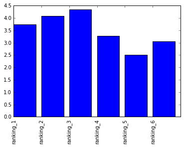
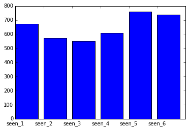
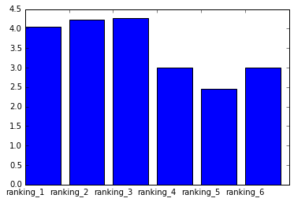
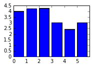
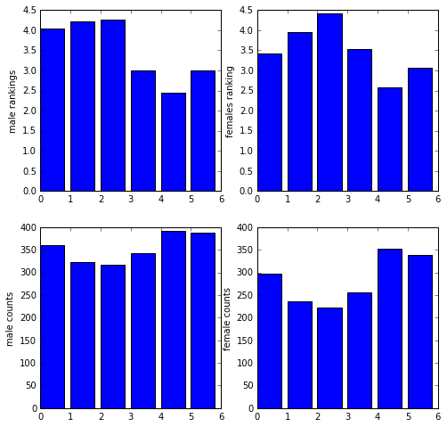

```python
import pandas as pd
star_wars = pd.read_csv("star_wars.csv",encoding = "ISO-8859-1")
star_wars.head(10)
```


<div>
<table border="1" class="dataframe">
  <thead>
    <tr style="text-align: right;">
      <th></th>
      <th>RespondentID</th>
      <th>Have you seen any of the 6 films in the Star Wars franchise?</th>
      <th>Do you consider yourself to be a fan of the Star Wars film franchise?</th>
      <th>Which of the following Star Wars films have you seen? Please select all that apply.</th>
      <th>Unnamed: 4</th>
      <th>Unnamed: 5</th>
      <th>Unnamed: 6</th>
      <th>Unnamed: 7</th>
      <th>Unnamed: 8</th>
      <th>Please rank the Star Wars films in order of preference with 1 being your favorite film in the franchise and 6 being your least favorite film.</th>
      <th>...</th>
      <th>Unnamed: 28</th>
      <th>Which character shot first?</th>
      <th>Are you familiar with the Expanded Universe?</th>
      <th>Do you consider yourself to be a fan of the Expanded Universe?ξ</th>
      <th>Do you consider yourself to be a fan of the Star Trek franchise?</th>
      <th>Gender</th>
      <th>Age</th>
      <th>Household Income</th>
      <th>Education</th>
      <th>Location (Census Region)</th>
    </tr>
  </thead>
  <tbody>
    <tr>
      <th>0</th>
      <td>NaN</td>
      <td>Response</td>
      <td>Response</td>
      <td>Star Wars: Episode I  The Phantom Menace</td>
      <td>Star Wars: Episode II  Attack of the Clones</td>
      <td>Star Wars: Episode III  Revenge of the Sith</td>
      <td>Star Wars: Episode IV  A New Hope</td>
      <td>Star Wars: Episode V The Empire Strikes Back</td>
      <td>Star Wars: Episode VI Return of the Jedi</td>
      <td>Star Wars: Episode I  The Phantom Menace</td>
      <td>...</td>
      <td>Yoda</td>
      <td>Response</td>
      <td>Response</td>
      <td>Response</td>
      <td>Response</td>
      <td>Response</td>
      <td>Response</td>
      <td>Response</td>
      <td>Response</td>
      <td>Response</td>
    </tr>
    <tr>
      <th>1</th>
      <td>3.292880e+09</td>
      <td>Yes</td>
      <td>Yes</td>
      <td>Star Wars: Episode I  The Phantom Menace</td>
      <td>Star Wars: Episode II  Attack of the Clones</td>
      <td>Star Wars: Episode III  Revenge of the Sith</td>
      <td>Star Wars: Episode IV  A New Hope</td>
      <td>Star Wars: Episode V The Empire Strikes Back</td>
      <td>Star Wars: Episode VI Return of the Jedi</td>
      <td>3</td>
      <td>...</td>
      <td>Very favorably</td>
      <td>I don't understand this question</td>
      <td>Yes</td>
      <td>No</td>
      <td>No</td>
      <td>Male</td>
      <td>18-29</td>
      <td>NaN</td>
      <td>High school degree</td>
      <td>South Atlantic</td>
    </tr>
    <tr>
      <th>2</th>
      <td>3.292880e+09</td>
      <td>No</td>
      <td>NaN</td>
      <td>NaN</td>
      <td>NaN</td>
      <td>NaN</td>
      <td>NaN</td>
      <td>NaN</td>
      <td>NaN</td>
      <td>NaN</td>
      <td>...</td>
      <td>NaN</td>
      <td>NaN</td>
      <td>NaN</td>
      <td>NaN</td>
      <td>Yes</td>
      <td>Male</td>
      <td>18-29</td>
      <td>$0 - $24,999</td>
      <td>Bachelor degree</td>
      <td>West South Central</td>
    </tr>
    <tr>
      <th>3</th>
      <td>3.292765e+09</td>
      <td>Yes</td>
      <td>No</td>
      <td>Star Wars: Episode I  The Phantom Menace</td>
      <td>Star Wars: Episode II  Attack of the Clones</td>
      <td>Star Wars: Episode III  Revenge of the Sith</td>
      <td>NaN</td>
      <td>NaN</td>
      <td>NaN</td>
      <td>1</td>
      <td>...</td>
      <td>Unfamiliar (N/A)</td>
      <td>I don't understand this question</td>
      <td>No</td>
      <td>NaN</td>
      <td>No</td>
      <td>Male</td>
      <td>18-29</td>
      <td>$0 - $24,999</td>
      <td>High school degree</td>
      <td>West North Central</td>
    </tr>
    <tr>
      <th>4</th>
      <td>3.292763e+09</td>
      <td>Yes</td>
      <td>Yes</td>
      <td>Star Wars: Episode I  The Phantom Menace</td>
      <td>Star Wars: Episode II  Attack of the Clones</td>
      <td>Star Wars: Episode III  Revenge of the Sith</td>
      <td>Star Wars: Episode IV  A New Hope</td>
      <td>Star Wars: Episode V The Empire Strikes Back</td>
      <td>Star Wars: Episode VI Return of the Jedi</td>
      <td>5</td>
      <td>...</td>
      <td>Very favorably</td>
      <td>I don't understand this question</td>
      <td>No</td>
      <td>NaN</td>
      <td>Yes</td>
      <td>Male</td>
      <td>18-29</td>
      <td>$100,000 - $149,999</td>
      <td>Some college or Associate degree</td>
      <td>West North Central</td>
    </tr>
    <tr>
      <th>5</th>
      <td>3.292731e+09</td>
      <td>Yes</td>
      <td>Yes</td>
      <td>Star Wars: Episode I  The Phantom Menace</td>
      <td>Star Wars: Episode II  Attack of the Clones</td>
      <td>Star Wars: Episode III  Revenge of the Sith</td>
      <td>Star Wars: Episode IV  A New Hope</td>
      <td>Star Wars: Episode V The Empire Strikes Back</td>
      <td>Star Wars: Episode VI Return of the Jedi</td>
      <td>5</td>
      <td>...</td>
      <td>Somewhat favorably</td>
      <td>Greedo</td>
      <td>Yes</td>
      <td>No</td>
      <td>No</td>
      <td>Male</td>
      <td>18-29</td>
      <td>$100,000 - $149,999</td>
      <td>Some college or Associate degree</td>
      <td>West North Central</td>
    </tr>
    <tr>
      <th>6</th>
      <td>3.292719e+09</td>
      <td>Yes</td>
      <td>Yes</td>
      <td>Star Wars: Episode I  The Phantom Menace</td>
      <td>Star Wars: Episode II  Attack of the Clones</td>
      <td>Star Wars: Episode III  Revenge of the Sith</td>
      <td>Star Wars: Episode IV  A New Hope</td>
      <td>Star Wars: Episode V The Empire Strikes Back</td>
      <td>Star Wars: Episode VI Return of the Jedi</td>
      <td>1</td>
      <td>...</td>
      <td>Very favorably</td>
      <td>Han</td>
      <td>Yes</td>
      <td>No</td>
      <td>Yes</td>
      <td>Male</td>
      <td>18-29</td>
      <td>$25,000 - $49,999</td>
      <td>Bachelor degree</td>
      <td>Middle Atlantic</td>
    </tr>
    <tr>
      <th>7</th>
      <td>3.292685e+09</td>
      <td>Yes</td>
      <td>Yes</td>
      <td>Star Wars: Episode I  The Phantom Menace</td>
      <td>Star Wars: Episode II  Attack of the Clones</td>
      <td>Star Wars: Episode III  Revenge of the Sith</td>
      <td>Star Wars: Episode IV  A New Hope</td>
      <td>Star Wars: Episode V The Empire Strikes Back</td>
      <td>Star Wars: Episode VI Return of the Jedi</td>
      <td>6</td>
      <td>...</td>
      <td>Very favorably</td>
      <td>Han</td>
      <td>Yes</td>
      <td>No</td>
      <td>No</td>
      <td>Male</td>
      <td>18-29</td>
      <td>NaN</td>
      <td>High school degree</td>
      <td>East North Central</td>
    </tr>
    <tr>
      <th>8</th>
      <td>3.292664e+09</td>
      <td>Yes</td>
      <td>Yes</td>
      <td>Star Wars: Episode I  The Phantom Menace</td>
      <td>Star Wars: Episode II  Attack of the Clones</td>
      <td>Star Wars: Episode III  Revenge of the Sith</td>
      <td>Star Wars: Episode IV  A New Hope</td>
      <td>Star Wars: Episode V The Empire Strikes Back</td>
      <td>Star Wars: Episode VI Return of the Jedi</td>
      <td>4</td>
      <td>...</td>
      <td>Very favorably</td>
      <td>Han</td>
      <td>No</td>
      <td>NaN</td>
      <td>Yes</td>
      <td>Male</td>
      <td>18-29</td>
      <td>NaN</td>
      <td>High school degree</td>
      <td>South Atlantic</td>
    </tr>
    <tr>
      <th>9</th>
      <td>3.292654e+09</td>
      <td>Yes</td>
      <td>Yes</td>
      <td>Star Wars: Episode I  The Phantom Menace</td>
      <td>Star Wars: Episode II  Attack of the Clones</td>
      <td>Star Wars: Episode III  Revenge of the Sith</td>
      <td>Star Wars: Episode IV  A New Hope</td>
      <td>Star Wars: Episode V The Empire Strikes Back</td>
      <td>Star Wars: Episode VI Return of the Jedi</td>
      <td>5</td>
      <td>...</td>
      <td>Somewhat favorably</td>
      <td>Han</td>
      <td>No</td>
      <td>NaN</td>
      <td>No</td>
      <td>Male</td>
      <td>18-29</td>
      <td>$0 - $24,999</td>
      <td>Some college or Associate degree</td>
      <td>South Atlantic</td>
    </tr>
  </tbody>
</table>
<p>10 rows × 38 columns</p>
</div>


```python
 star_wars.columns
```


    Index(['RespondentID',
           'Have you seen any of the 6 films in the Star Wars franchise?',
           'Do you consider yourself to be a fan of the Star Wars film franchise?',
           'Which of the following Star Wars films have you seen? Please select all that apply.',
           'Unnamed: 4', 'Unnamed: 5', 'Unnamed: 6', 'Unnamed: 7', 'Unnamed: 8',
           'Please rank the Star Wars films in order of preference with 1 being your favorite film in the franchise and 6 being your least favorite film.',
           'Unnamed: 10', 'Unnamed: 11', 'Unnamed: 12', 'Unnamed: 13',
           'Unnamed: 14',
           'Please state whether you view the following characters favorably, unfavorably, or are unfamiliar with him/her.',
           'Unnamed: 16', 'Unnamed: 17', 'Unnamed: 18', 'Unnamed: 19',
           'Unnamed: 20', 'Unnamed: 21', 'Unnamed: 22', 'Unnamed: 23',
           'Unnamed: 24', 'Unnamed: 25', 'Unnamed: 26', 'Unnamed: 27',
           'Unnamed: 28', 'Which character shot first?',
           'Are you familiar with the Expanded Universe?',
           'Do you consider yourself to be a fan of the Expanded Universe?ξ',
           'Do you consider yourself to be a fan of the Star Trek franchise?',
           'Gender', 'Age', 'Household Income', 'Education',
           'Location (Census Region)'],
          dtype='object')


```python
star_wars["RespondentID"].dropna().shape[0]
```


    1186


```python
star_wars["RespondentID"][pd.isnull(star_wars["RespondentID"])]
```


    0   NaN
    Name: RespondentID, dtype: float64


```python
star_wars["RespondentID"][pd.notnull(star_wars["RespondentID"])].shape[0]
```


    1186


```python
pd.notnull(star_wars["RespondentID"])
```


    0       False
    1        True
    2        True
    3        True
    4        True
    5        True
    6        True
    7        True
    8        True
    9        True
    10       True
    11       True
    12       True
    13       True
    14       True
    15       True
    16       True
    17       True
    18       True
    19       True
    20       True
    21       True
    22       True
    23       True
    24       True
    25       True
    26       True
    27       True
    28       True
    29       True
            ...  
    1157     True
    1158     True
    1159     True
    1160     True
    1161     True
    1162     True
    1163     True
    1164     True
    1165     True
    1166     True
    1167     True
    1168     True
    1169     True
    1170     True
    1171     True
    1172     True
    1173     True
    1174     True
    1175     True
    1176     True
    1177     True
    1178     True
    1179     True
    1180     True
    1181     True
    1182     True
    1183     True
    1184     True
    1185     True
    1186     True
    Name: RespondentID, dtype: bool


```python
star_wars = star_wars[pd.notnull(star_wars["RespondentID"])]
star_wars.head()
```


<div>
<table border="1" class="dataframe">
  <thead>
    <tr style="text-align: right;">
      <th></th>
      <th>RespondentID</th>
      <th>Have you seen any of the 6 films in the Star Wars franchise?</th>
      <th>Do you consider yourself to be a fan of the Star Wars film franchise?</th>
      <th>Which of the following Star Wars films have you seen? Please select all that apply.</th>
      <th>Unnamed: 4</th>
      <th>Unnamed: 5</th>
      <th>Unnamed: 6</th>
      <th>Unnamed: 7</th>
      <th>Unnamed: 8</th>
      <th>Please rank the Star Wars films in order of preference with 1 being your favorite film in the franchise and 6 being your least favorite film.</th>
      <th>...</th>
      <th>Unnamed: 28</th>
      <th>Which character shot first?</th>
      <th>Are you familiar with the Expanded Universe?</th>
      <th>Do you consider yourself to be a fan of the Expanded Universe?ξ</th>
      <th>Do you consider yourself to be a fan of the Star Trek franchise?</th>
      <th>Gender</th>
      <th>Age</th>
      <th>Household Income</th>
      <th>Education</th>
      <th>Location (Census Region)</th>
    </tr>
  </thead>
  <tbody>
    <tr>
      <th>1</th>
      <td>3.292880e+09</td>
      <td>Yes</td>
      <td>Yes</td>
      <td>Star Wars: Episode I  The Phantom Menace</td>
      <td>Star Wars: Episode II  Attack of the Clones</td>
      <td>Star Wars: Episode III  Revenge of the Sith</td>
      <td>Star Wars: Episode IV  A New Hope</td>
      <td>Star Wars: Episode V The Empire Strikes Back</td>
      <td>Star Wars: Episode VI Return of the Jedi</td>
      <td>3</td>
      <td>...</td>
      <td>Very favorably</td>
      <td>I don't understand this question</td>
      <td>Yes</td>
      <td>No</td>
      <td>No</td>
      <td>Male</td>
      <td>18-29</td>
      <td>NaN</td>
      <td>High school degree</td>
      <td>South Atlantic</td>
    </tr>
    <tr>
      <th>2</th>
      <td>3.292880e+09</td>
      <td>No</td>
      <td>NaN</td>
      <td>NaN</td>
      <td>NaN</td>
      <td>NaN</td>
      <td>NaN</td>
      <td>NaN</td>
      <td>NaN</td>
      <td>NaN</td>
      <td>...</td>
      <td>NaN</td>
      <td>NaN</td>
      <td>NaN</td>
      <td>NaN</td>
      <td>Yes</td>
      <td>Male</td>
      <td>18-29</td>
      <td>$0 - $24,999</td>
      <td>Bachelor degree</td>
      <td>West South Central</td>
    </tr>
    <tr>
      <th>3</th>
      <td>3.292765e+09</td>
      <td>Yes</td>
      <td>No</td>
      <td>Star Wars: Episode I  The Phantom Menace</td>
      <td>Star Wars: Episode II  Attack of the Clones</td>
      <td>Star Wars: Episode III  Revenge of the Sith</td>
      <td>NaN</td>
      <td>NaN</td>
      <td>NaN</td>
      <td>1</td>
      <td>...</td>
      <td>Unfamiliar (N/A)</td>
      <td>I don't understand this question</td>
      <td>No</td>
      <td>NaN</td>
      <td>No</td>
      <td>Male</td>
      <td>18-29</td>
      <td>$0 - $24,999</td>
      <td>High school degree</td>
      <td>West North Central</td>
    </tr>
    <tr>
      <th>4</th>
      <td>3.292763e+09</td>
      <td>Yes</td>
      <td>Yes</td>
      <td>Star Wars: Episode I  The Phantom Menace</td>
      <td>Star Wars: Episode II  Attack of the Clones</td>
      <td>Star Wars: Episode III  Revenge of the Sith</td>
      <td>Star Wars: Episode IV  A New Hope</td>
      <td>Star Wars: Episode V The Empire Strikes Back</td>
      <td>Star Wars: Episode VI Return of the Jedi</td>
      <td>5</td>
      <td>...</td>
      <td>Very favorably</td>
      <td>I don't understand this question</td>
      <td>No</td>
      <td>NaN</td>
      <td>Yes</td>
      <td>Male</td>
      <td>18-29</td>
      <td>$100,000 - $149,999</td>
      <td>Some college or Associate degree</td>
      <td>West North Central</td>
    </tr>
    <tr>
      <th>5</th>
      <td>3.292731e+09</td>
      <td>Yes</td>
      <td>Yes</td>
      <td>Star Wars: Episode I  The Phantom Menace</td>
      <td>Star Wars: Episode II  Attack of the Clones</td>
      <td>Star Wars: Episode III  Revenge of the Sith</td>
      <td>Star Wars: Episode IV  A New Hope</td>
      <td>Star Wars: Episode V The Empire Strikes Back</td>
      <td>Star Wars: Episode VI Return of the Jedi</td>
      <td>5</td>
      <td>...</td>
      <td>Somewhat favorably</td>
      <td>Greedo</td>
      <td>Yes</td>
      <td>No</td>
      <td>No</td>
      <td>Male</td>
      <td>18-29</td>
      <td>$100,000 - $149,999</td>
      <td>Some college or Associate degree</td>
      <td>West North Central</td>
    </tr>
  </tbody>
</table>
<p>5 rows × 38 columns</p>
</div>


```python
yes_no = {"Yes" : True,"No" :False}
star_wars = star_wars["Have you seen any of the 6 films in the Star Wars franchise?"].map(yes_no)
star_wars.head()
```


    1     True
    2    False
    3     True
    4     True
    5     True
    Name: Have you seen any of the 6 films in the Star Wars franchise?, dtype: bool


```python
cols = star_wars.columns[1:3]
yes_no = {"Yes" : True,"No" :False}
for col in cols:
    star_wars[col] =  star_wars[col].map(yes_no)
star_wars.head()
```


<div>
<table border="1" class="dataframe">
  <thead>
    <tr style="text-align: right;">
      <th></th>
      <th>RespondentID</th>
      <th>Have you seen any of the 6 films in the Star Wars franchise?</th>
      <th>Do you consider yourself to be a fan of the Star Wars film franchise?</th>
      <th>Which of the following Star Wars films have you seen? Please select all that apply.</th>
      <th>Unnamed: 4</th>
      <th>Unnamed: 5</th>
      <th>Unnamed: 6</th>
      <th>Unnamed: 7</th>
      <th>Unnamed: 8</th>
      <th>Please rank the Star Wars films in order of preference with 1 being your favorite film in the franchise and 6 being your least favorite film.</th>
      <th>...</th>
      <th>Unnamed: 28</th>
      <th>Which character shot first?</th>
      <th>Are you familiar with the Expanded Universe?</th>
      <th>Do you consider yourself to be a fan of the Expanded Universe?ξ</th>
      <th>Do you consider yourself to be a fan of the Star Trek franchise?</th>
      <th>Gender</th>
      <th>Age</th>
      <th>Household Income</th>
      <th>Education</th>
      <th>Location (Census Region)</th>
    </tr>
  </thead>
  <tbody>
    <tr>
      <th>0</th>
      <td>NaN</td>
      <td>NaN</td>
      <td>NaN</td>
      <td>Star Wars: Episode I  The Phantom Menace</td>
      <td>Star Wars: Episode II  Attack of the Clones</td>
      <td>Star Wars: Episode III  Revenge of the Sith</td>
      <td>Star Wars: Episode IV  A New Hope</td>
      <td>Star Wars: Episode V The Empire Strikes Back</td>
      <td>Star Wars: Episode VI Return of the Jedi</td>
      <td>Star Wars: Episode I  The Phantom Menace</td>
      <td>...</td>
      <td>Yoda</td>
      <td>Response</td>
      <td>Response</td>
      <td>Response</td>
      <td>Response</td>
      <td>Response</td>
      <td>Response</td>
      <td>Response</td>
      <td>Response</td>
      <td>Response</td>
    </tr>
    <tr>
      <th>1</th>
      <td>3.292880e+09</td>
      <td>True</td>
      <td>True</td>
      <td>Star Wars: Episode I  The Phantom Menace</td>
      <td>Star Wars: Episode II  Attack of the Clones</td>
      <td>Star Wars: Episode III  Revenge of the Sith</td>
      <td>Star Wars: Episode IV  A New Hope</td>
      <td>Star Wars: Episode V The Empire Strikes Back</td>
      <td>Star Wars: Episode VI Return of the Jedi</td>
      <td>3</td>
      <td>...</td>
      <td>Very favorably</td>
      <td>I don't understand this question</td>
      <td>Yes</td>
      <td>No</td>
      <td>No</td>
      <td>Male</td>
      <td>18-29</td>
      <td>NaN</td>
      <td>High school degree</td>
      <td>South Atlantic</td>
    </tr>
    <tr>
      <th>2</th>
      <td>3.292880e+09</td>
      <td>False</td>
      <td>NaN</td>
      <td>NaN</td>
      <td>NaN</td>
      <td>NaN</td>
      <td>NaN</td>
      <td>NaN</td>
      <td>NaN</td>
      <td>NaN</td>
      <td>...</td>
      <td>NaN</td>
      <td>NaN</td>
      <td>NaN</td>
      <td>NaN</td>
      <td>Yes</td>
      <td>Male</td>
      <td>18-29</td>
      <td>$0 - $24,999</td>
      <td>Bachelor degree</td>
      <td>West South Central</td>
    </tr>
    <tr>
      <th>3</th>
      <td>3.292765e+09</td>
      <td>True</td>
      <td>False</td>
      <td>Star Wars: Episode I  The Phantom Menace</td>
      <td>Star Wars: Episode II  Attack of the Clones</td>
      <td>Star Wars: Episode III  Revenge of the Sith</td>
      <td>NaN</td>
      <td>NaN</td>
      <td>NaN</td>
      <td>1</td>
      <td>...</td>
      <td>Unfamiliar (N/A)</td>
      <td>I don't understand this question</td>
      <td>No</td>
      <td>NaN</td>
      <td>No</td>
      <td>Male</td>
      <td>18-29</td>
      <td>$0 - $24,999</td>
      <td>High school degree</td>
      <td>West North Central</td>
    </tr>
    <tr>
      <th>4</th>
      <td>3.292763e+09</td>
      <td>True</td>
      <td>True</td>
      <td>Star Wars: Episode I  The Phantom Menace</td>
      <td>Star Wars: Episode II  Attack of the Clones</td>
      <td>Star Wars: Episode III  Revenge of the Sith</td>
      <td>Star Wars: Episode IV  A New Hope</td>
      <td>Star Wars: Episode V The Empire Strikes Back</td>
      <td>Star Wars: Episode VI Return of the Jedi</td>
      <td>5</td>
      <td>...</td>
      <td>Very favorably</td>
      <td>I don't understand this question</td>
      <td>No</td>
      <td>NaN</td>
      <td>Yes</td>
      <td>Male</td>
      <td>18-29</td>
      <td>$100,000 - $149,999</td>
      <td>Some college or Associate degree</td>
      <td>West North Central</td>
    </tr>
  </tbody>
</table>
<p>5 rows × 38 columns</p>
</div>


```python
import numpy as np 
movie = {
    "Star Wars: Episode I  The Phantom Menace": True,
    np.nan:False,
    "Star Wars: Episode II  Attack of the Clones": True,
    "Star Wars: Episode III  Revenge of the Sith": True,
    "Star Wars: Episode IV  A New Hope": True,
    "Star Wars: Episode V The Empire Strikes Back": True,
    "Star Wars: Episode VI Return of the Jedi": True
}
#series methods:
cols = star_wars.columns[3:9]
for col in cols:
    star_wars[col] =star_wars[col].map(movie)
star_wars.head()
```


<div>
<table border="1" class="dataframe">
  <thead>
    <tr style="text-align: right;">
      <th></th>
      <th>RespondentID</th>
      <th>Have you seen any of the 6 films in the Star Wars franchise?</th>
      <th>Do you consider yourself to be a fan of the Star Wars film franchise?</th>
      <th>Which of the following Star Wars films have you seen? Please select all that apply.</th>
      <th>Unnamed: 4</th>
      <th>Unnamed: 5</th>
      <th>Unnamed: 6</th>
      <th>Unnamed: 7</th>
      <th>Unnamed: 8</th>
      <th>Please rank the Star Wars films in order of preference with 1 being your favorite film in the franchise and 6 being your least favorite film.</th>
      <th>...</th>
      <th>Unnamed: 28</th>
      <th>Which character shot first?</th>
      <th>Are you familiar with the Expanded Universe?</th>
      <th>Do you consider yourself to be a fan of the Expanded Universe?ξ</th>
      <th>Do you consider yourself to be a fan of the Star Trek franchise?</th>
      <th>Gender</th>
      <th>Age</th>
      <th>Household Income</th>
      <th>Education</th>
      <th>Location (Census Region)</th>
    </tr>
  </thead>
  <tbody>
    <tr>
      <th>0</th>
      <td>NaN</td>
      <td>NaN</td>
      <td>NaN</td>
      <td>True</td>
      <td>True</td>
      <td>True</td>
      <td>True</td>
      <td>True</td>
      <td>True</td>
      <td>Star Wars: Episode I  The Phantom Menace</td>
      <td>...</td>
      <td>Yoda</td>
      <td>Response</td>
      <td>Response</td>
      <td>Response</td>
      <td>Response</td>
      <td>Response</td>
      <td>Response</td>
      <td>Response</td>
      <td>Response</td>
      <td>Response</td>
    </tr>
    <tr>
      <th>1</th>
      <td>3.292880e+09</td>
      <td>True</td>
      <td>True</td>
      <td>True</td>
      <td>True</td>
      <td>True</td>
      <td>True</td>
      <td>True</td>
      <td>True</td>
      <td>3</td>
      <td>...</td>
      <td>Very favorably</td>
      <td>I don't understand this question</td>
      <td>Yes</td>
      <td>No</td>
      <td>No</td>
      <td>Male</td>
      <td>18-29</td>
      <td>NaN</td>
      <td>High school degree</td>
      <td>South Atlantic</td>
    </tr>
    <tr>
      <th>2</th>
      <td>3.292880e+09</td>
      <td>False</td>
      <td>NaN</td>
      <td>False</td>
      <td>False</td>
      <td>False</td>
      <td>False</td>
      <td>False</td>
      <td>False</td>
      <td>NaN</td>
      <td>...</td>
      <td>NaN</td>
      <td>NaN</td>
      <td>NaN</td>
      <td>NaN</td>
      <td>Yes</td>
      <td>Male</td>
      <td>18-29</td>
      <td>$0 - $24,999</td>
      <td>Bachelor degree</td>
      <td>West South Central</td>
    </tr>
    <tr>
      <th>3</th>
      <td>3.292765e+09</td>
      <td>True</td>
      <td>False</td>
      <td>True</td>
      <td>True</td>
      <td>True</td>
      <td>False</td>
      <td>False</td>
      <td>False</td>
      <td>1</td>
      <td>...</td>
      <td>Unfamiliar (N/A)</td>
      <td>I don't understand this question</td>
      <td>No</td>
      <td>NaN</td>
      <td>No</td>
      <td>Male</td>
      <td>18-29</td>
      <td>$0 - $24,999</td>
      <td>High school degree</td>
      <td>West North Central</td>
    </tr>
    <tr>
      <th>4</th>
      <td>3.292763e+09</td>
      <td>True</td>
      <td>True</td>
      <td>True</td>
      <td>True</td>
      <td>True</td>
      <td>True</td>
      <td>True</td>
      <td>True</td>
      <td>5</td>
      <td>...</td>
      <td>Very favorably</td>
      <td>I don't understand this question</td>
      <td>No</td>
      <td>NaN</td>
      <td>Yes</td>
      <td>Male</td>
      <td>18-29</td>
      <td>$100,000 - $149,999</td>
      <td>Some college or Associate degree</td>
      <td>West North Central</td>
    </tr>
  </tbody>
</table>
<p>5 rows × 38 columns</p>
</div>


```python

star_wars = star_wars.rename(columns = {"Which of the following Star Wars films have you seen? Please select all that apply.": "seen_1",
        "Unnamed: 4": "seen_2",
        "Unnamed: 5": "seen_3",
        "Unnamed: 6": "seen_4",
        "Unnamed: 7": "seen_5",
        "Unnamed: 8": "seen_6"})
star_wars.head()
```


<div>
<table border="1" class="dataframe">
  <thead>
    <tr style="text-align: right;">
      <th></th>
      <th>RespondentID</th>
      <th>Have you seen any of the 6 films in the Star Wars franchise?</th>
      <th>Do you consider yourself to be a fan of the Star Wars film franchise?</th>
      <th>seen_1</th>
      <th>seen_2</th>
      <th>seen_3</th>
      <th>seen_4</th>
      <th>seen_5</th>
      <th>seen_6</th>
      <th>Please rank the Star Wars films in order of preference with 1 being your favorite film in the franchise and 6 being your least favorite film.</th>
      <th>...</th>
      <th>Unnamed: 28</th>
      <th>Which character shot first?</th>
      <th>Are you familiar with the Expanded Universe?</th>
      <th>Do you consider yourself to be a fan of the Expanded Universe?ξ</th>
      <th>Do you consider yourself to be a fan of the Star Trek franchise?</th>
      <th>Gender</th>
      <th>Age</th>
      <th>Household Income</th>
      <th>Education</th>
      <th>Location (Census Region)</th>
    </tr>
  </thead>
  <tbody>
    <tr>
      <th>0</th>
      <td>NaN</td>
      <td>NaN</td>
      <td>NaN</td>
      <td>True</td>
      <td>True</td>
      <td>True</td>
      <td>True</td>
      <td>True</td>
      <td>True</td>
      <td>Star Wars: Episode I  The Phantom Menace</td>
      <td>...</td>
      <td>Yoda</td>
      <td>Response</td>
      <td>Response</td>
      <td>Response</td>
      <td>Response</td>
      <td>Response</td>
      <td>Response</td>
      <td>Response</td>
      <td>Response</td>
      <td>Response</td>
    </tr>
    <tr>
      <th>1</th>
      <td>3.292880e+09</td>
      <td>True</td>
      <td>True</td>
      <td>True</td>
      <td>True</td>
      <td>True</td>
      <td>True</td>
      <td>True</td>
      <td>True</td>
      <td>3</td>
      <td>...</td>
      <td>Very favorably</td>
      <td>I don't understand this question</td>
      <td>Yes</td>
      <td>No</td>
      <td>No</td>
      <td>Male</td>
      <td>18-29</td>
      <td>NaN</td>
      <td>High school degree</td>
      <td>South Atlantic</td>
    </tr>
    <tr>
      <th>2</th>
      <td>3.292880e+09</td>
      <td>False</td>
      <td>NaN</td>
      <td>False</td>
      <td>False</td>
      <td>False</td>
      <td>False</td>
      <td>False</td>
      <td>False</td>
      <td>NaN</td>
      <td>...</td>
      <td>NaN</td>
      <td>NaN</td>
      <td>NaN</td>
      <td>NaN</td>
      <td>Yes</td>
      <td>Male</td>
      <td>18-29</td>
      <td>$0 - $24,999</td>
      <td>Bachelor degree</td>
      <td>West South Central</td>
    </tr>
    <tr>
      <th>3</th>
      <td>3.292765e+09</td>
      <td>True</td>
      <td>False</td>
      <td>True</td>
      <td>True</td>
      <td>True</td>
      <td>False</td>
      <td>False</td>
      <td>False</td>
      <td>1</td>
      <td>...</td>
      <td>Unfamiliar (N/A)</td>
      <td>I don't understand this question</td>
      <td>No</td>
      <td>NaN</td>
      <td>No</td>
      <td>Male</td>
      <td>18-29</td>
      <td>$0 - $24,999</td>
      <td>High school degree</td>
      <td>West North Central</td>
    </tr>
    <tr>
      <th>4</th>
      <td>3.292763e+09</td>
      <td>True</td>
      <td>True</td>
      <td>True</td>
      <td>True</td>
      <td>True</td>
      <td>True</td>
      <td>True</td>
      <td>True</td>
      <td>5</td>
      <td>...</td>
      <td>Very favorably</td>
      <td>I don't understand this question</td>
      <td>No</td>
      <td>NaN</td>
      <td>Yes</td>
      <td>Male</td>
      <td>18-29</td>
      <td>$100,000 - $149,999</td>
      <td>Some college or Associate degree</td>
      <td>West North Central</td>
    </tr>
  </tbody>
</table>
<p>5 rows × 38 columns</p>
</div>


```python
star = star_wars[star_wars.columns[9:15]].astype(float)

```


    ---------------------------------------------------------------------------

    ValueError                                Traceback (most recent call last)

    <ipython-input-274-e554dce2cb78> in <module>()
    ----> 1 star = star_wars[star_wars.columns[9:15]].astype(float)
    

    C:\Users\asus\Anaconda3\lib\site-packages\pandas\core\generic.py in astype(self, dtype, copy, raise_on_error, **kwargs)
       2945 
       2946         mgr = self._data.astype(dtype=dtype, copy=copy,
    -> 2947                                 raise_on_error=raise_on_error, **kwargs)
       2948         return self._constructor(mgr).__finalize__(self)
       2949 
    

    C:\Users\asus\Anaconda3\lib\site-packages\pandas\core\internals.py in astype(self, dtype, **kwargs)
       2871 
       2872     def astype(self, dtype, **kwargs):
    -> 2873         return self.apply('astype', dtype=dtype, **kwargs)
       2874 
       2875     def convert(self, **kwargs):
    

    C:\Users\asus\Anaconda3\lib\site-packages\pandas\core\internals.py in apply(self, f, axes, filter, do_integrity_check, consolidate, **kwargs)
       2830 
       2831             kwargs['mgr'] = self
    -> 2832             applied = getattr(b, f)(**kwargs)
       2833             result_blocks = _extend_blocks(applied, result_blocks)
       2834 
    

    C:\Users\asus\Anaconda3\lib\site-packages\pandas\core\internals.py in astype(self, dtype, copy, raise_on_error, values, **kwargs)
        420                **kwargs):
        421         return self._astype(dtype, copy=copy, raise_on_error=raise_on_error,
    --> 422                             values=values, **kwargs)
        423 
        424     def _astype(self, dtype, copy=False, raise_on_error=True, values=None,
    

    C:\Users\asus\Anaconda3\lib\site-packages\pandas\core\internals.py in _astype(self, dtype, copy, raise_on_error, values, klass, mgr, **kwargs)
        463 
        464                 # _astype_nansafe works fine with 1-d only
    --> 465                 values = com._astype_nansafe(values.ravel(), dtype, copy=True)
        466                 values = values.reshape(self.shape)
        467 
    

    C:\Users\asus\Anaconda3\lib\site-packages\pandas\core\common.py in _astype_nansafe(arr, dtype, copy)
       2629 
       2630     if copy:
    -> 2631         return arr.astype(dtype)
       2632     return arr.view(dtype)
       2633 
    

    ValueError: could not convert string to float: 'Star Wars: Episode VI Return of the Jedi'


```python
star_wars = star_wars.rename(columns = {'Please rank the Star Wars films in order of preference with 1 being your favorite film in the franchise and 6 being your least favorite film.' : "ranking_1",
       'Unnamed: 10' : "ranking_2", 'Unnamed: 11' : "ranking_3", 'Unnamed: 12' : "ranking_4", 'Unnamed: 13' : "ranking_5",
       'Unnamed: 14' : "ranking_6"})
star_wars.head()
```


<div>
<table border="1" class="dataframe">
  <thead>
    <tr style="text-align: right;">
      <th></th>
      <th>RespondentID</th>
      <th>Have you seen any of the 6 films in the Star Wars franchise?</th>
      <th>Do you consider yourself to be a fan of the Star Wars film franchise?</th>
      <th>seen_1</th>
      <th>seen_2</th>
      <th>seen_3</th>
      <th>seen_4</th>
      <th>seen_5</th>
      <th>seen_6</th>
      <th>ranking_1</th>
      <th>...</th>
      <th>Unnamed: 28</th>
      <th>Which character shot first?</th>
      <th>Are you familiar with the Expanded Universe?</th>
      <th>Do you consider yourself to be a fan of the Expanded Universe?ξ</th>
      <th>Do you consider yourself to be a fan of the Star Trek franchise?</th>
      <th>Gender</th>
      <th>Age</th>
      <th>Household Income</th>
      <th>Education</th>
      <th>Location (Census Region)</th>
    </tr>
  </thead>
  <tbody>
    <tr>
      <th>0</th>
      <td>NaN</td>
      <td>NaN</td>
      <td>NaN</td>
      <td>True</td>
      <td>True</td>
      <td>True</td>
      <td>True</td>
      <td>True</td>
      <td>True</td>
      <td>Star Wars: Episode I  The Phantom Menace</td>
      <td>...</td>
      <td>Yoda</td>
      <td>Response</td>
      <td>Response</td>
      <td>Response</td>
      <td>Response</td>
      <td>Response</td>
      <td>Response</td>
      <td>Response</td>
      <td>Response</td>
      <td>Response</td>
    </tr>
    <tr>
      <th>1</th>
      <td>3.292880e+09</td>
      <td>True</td>
      <td>True</td>
      <td>True</td>
      <td>True</td>
      <td>True</td>
      <td>True</td>
      <td>True</td>
      <td>True</td>
      <td>3</td>
      <td>...</td>
      <td>Very favorably</td>
      <td>I don't understand this question</td>
      <td>Yes</td>
      <td>No</td>
      <td>No</td>
      <td>Male</td>
      <td>18-29</td>
      <td>NaN</td>
      <td>High school degree</td>
      <td>South Atlantic</td>
    </tr>
    <tr>
      <th>2</th>
      <td>3.292880e+09</td>
      <td>False</td>
      <td>NaN</td>
      <td>False</td>
      <td>False</td>
      <td>False</td>
      <td>False</td>
      <td>False</td>
      <td>False</td>
      <td>NaN</td>
      <td>...</td>
      <td>NaN</td>
      <td>NaN</td>
      <td>NaN</td>
      <td>NaN</td>
      <td>Yes</td>
      <td>Male</td>
      <td>18-29</td>
      <td>$0 - $24,999</td>
      <td>Bachelor degree</td>
      <td>West South Central</td>
    </tr>
    <tr>
      <th>3</th>
      <td>3.292765e+09</td>
      <td>True</td>
      <td>False</td>
      <td>True</td>
      <td>True</td>
      <td>True</td>
      <td>False</td>
      <td>False</td>
      <td>False</td>
      <td>1</td>
      <td>...</td>
      <td>Unfamiliar (N/A)</td>
      <td>I don't understand this question</td>
      <td>No</td>
      <td>NaN</td>
      <td>No</td>
      <td>Male</td>
      <td>18-29</td>
      <td>$0 - $24,999</td>
      <td>High school degree</td>
      <td>West North Central</td>
    </tr>
    <tr>
      <th>4</th>
      <td>3.292763e+09</td>
      <td>True</td>
      <td>True</td>
      <td>True</td>
      <td>True</td>
      <td>True</td>
      <td>True</td>
      <td>True</td>
      <td>True</td>
      <td>5</td>
      <td>...</td>
      <td>Very favorably</td>
      <td>I don't understand this question</td>
      <td>No</td>
      <td>NaN</td>
      <td>Yes</td>
      <td>Male</td>
      <td>18-29</td>
      <td>$100,000 - $149,999</td>
      <td>Some college or Associate degree</td>
      <td>West North Central</td>
    </tr>
  </tbody>
</table>
<p>5 rows × 38 columns</p>
</div>


```python
a = star_wars[star_wars.columns[9:15]].dropna().loc[1:,:].astype(float).mean()
```


```python
import matplotlib.pyplot as plt
%matplotlib inline
plt.bar(range(6),a)
plt.xticks(range(6),a.index,rotation = 90)
plt.show()
```





```python
b = star_wars[star_wars.columns[3:9]].sum()
```


```python
plt.bar(range(6),b)
plt.xticks(range(6),b.index)
plt.show()
```





```python
males = star_wars[star_wars["Gender"] == "Male"]
females =star_wars[star_wars["Gender"] == "Female"]
aa = males[males.columns[9:15]].dropna().astype(float).mean()
bb  =females[males.columns[9:15]].dropna().astype(float).mean()
aaa = males[males.columns[3:9]].sum()
bbb  =females[females.columns[3:9]].sum()
print(aa)
print(bb)
print(aaa)
print(bbb)
```

    ranking_1    4.045024
    ranking_2    4.229858
    ranking_3    4.274882
    ranking_4    2.995261
    ranking_5    2.452607
    ranking_6    3.002370
    dtype: float64
    ranking_1    3.429293
    ranking_2    3.957071
    ranking_3    4.424242
    ranking_4    3.540404
    ranking_5    2.573232
    ranking_6    3.075758
    dtype: float64
    seen_1    361
    seen_2    323
    seen_3    317
    seen_4    342
    seen_5    392
    seen_6    387
    dtype: int64
    seen_1    298
    seen_2    237
    seen_3    222
    seen_4    255
    seen_5    353
    seen_6    338
    dtype: int64
    


```python
males = star_wars[star_wars["Gender"] == "Male"]
males[males.columns[9:15]].dropna().astype(float).mean()
```


    ranking_1    4.045024
    ranking_2    4.229858
    ranking_3    4.274882
    ranking_4    2.995261
    ranking_5    2.452607
    ranking_6    3.002370
    dtype: float64


```python
plt.bar(range(6),aa)
plt.xticks(range(6),aa.index)
plt.show()
```





```python
fig = plt.figure()
ax1 = fig.add_subplot(2,2,1)
ax1.bar(range(6),aa)
ax1.set(ylim = (0,4.5),yticklabels =([0,0.5,1,1.5,2,2.5,3,3.5,4,4.5]),xlim = (0,6),xticklabels = ([0,1,2,3,4,5]) )

plt.show()
```





```python
fig = plt.figure(figsize = (8,8))
ax1 = fig.add_subplot(2,2,1)
ax1.bar(range(6),aa)
ax1.set_ylabel("male rankings")
ax2  =fig.add_subplot(2,2,2)
ax2.bar(range(6),bb)
ax2.set_ylabel("females ranking")
ax3  =fig.add_subplot(2,2,3)
ax3.bar(range(6),aaa)
ax3.set_ylabel("male counts")
ax4  =fig.add_subplot(2,2,4)
ax4.bar(range(6),bbb)
#ax4.get_yaxis().set_visible(False)
ax4.set_ylabel("female counts")
plt.show()

```





```python

```
